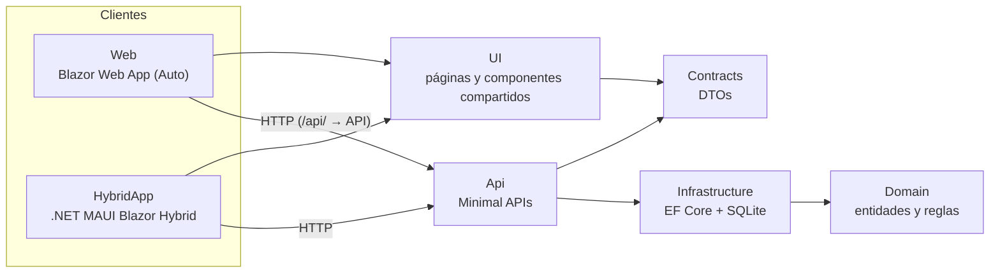

# CommunityHub

La app de la comunidad [DotNet Desarrolladores](https://t.me/DotNetDesarrolladoresGrupo), construida en público.

De octubre a diciembre de 2026 voy a construir aquí una app completa con Blazor, ASP.NET Core y .NET MAUI, con sus errores incluidos. Cada viernes cuento en [LinkedIn](https://www.linkedin.com/in/brian-perez-lopez/) qué avancé, qué se rompió y qué aprendí.

Como hicimos con [PetLand](https://github.com/Desarrolladores-Net/PetLand), pero esta vez en público y con el stack completo de .NET.

## ¿Qué va a hacer?

Retos de código cada semana y un ranking para ver quién va primero. Lo mismo que hacemos hoy a mano en el grupo, pero con su propia app:

- Listado y detalle de los retos
- Envío de soluciones
- Ranking en tiempo real
- Login
- App móvil con la misma interfaz que la web (Android y Windows)

## Arquitectura

La idea es la de [eShop](https://github.com/dotnet/eShop), la app de referencia de Microsoft: un dominio sin dependencias, la infraestructura aparte, una API con Minimal APIs, una librería de componentes que comparten la web y la app, y Aspire para arrancarlo todo junto.



| Proyecto | Qué hace |
|---|---|
| `CommunityHub.Domain` | Entidades y reglas del negocio (`Reto`). No depende de nada: ni de EF ni de ASP.NET |
| `CommunityHub.Infrastructure` | EF Core + SQLite: `DbContext`, configuraciones, migraciones y datos de ejemplo |
| `CommunityHub.Contracts` | Los DTOs que comparten la API, la web y la app |
| `CommunityHub.Api` | Minimal APIs agrupadas por funcionalidad, validación, ProblemDetails y OpenAPI |
| `CommunityHub.UI` | Razor Class Library: las páginas y componentes que usan la web y la app |
| `CommunityHub.Web` | Blazor Web App (render mode Auto). Reenvía `/api/` a la API para el navegador |
| `CommunityHub.Web.Client` | La parte que corre en el navegador con WebAssembly |
| `CommunityHub.HybridApp` | App para Android y Windows con .NET MAUI Blazor Hybrid |
| `CommunityHub.AppHost` | Aspire: arranca la API y la web con un solo comando, con panel de logs y trazas |
| `CommunityHub.ServiceDefaults` | Health checks, OpenTelemetry, resiliencia y service discovery |

Todo en .NET 10. En noviembre lo migramos a .NET 11.

## Estado

🚧 **Semana 1.** La arquitectura está montada y funciona de punta a punta con el primer caso: los **retos**. La API los guarda en SQLite, la web los muestra (la app usa las mismas páginas) y cada capa tiene sus tests.

| Semana | Qué se construye |
|---|---|
| 28 sep – 2 oct | Arquitectura de la solución y listado de retos ✅ |
| Octubre | Detalle de retos, envío de soluciones y validación |
| 2 – 6 nov | Login con Identity y passkeys |
| 16 – 20 nov | Migración a .NET 11 |
| 23 – 27 nov | Ranking en tiempo real con SignalR |
| 7 – 11 dic | La app en el móvil: APK instalable y lo nativo (cámara, notificaciones) |

## Cómo participar

- **Entra al [grupo de Telegram](https://t.me/DotNetDesarrolladoresGrupo)** y cuéntanos qué le pondrías a la app. Las funcionalidades se votan ahí.
- **En octubre arranca Call Of Code:** voy a abrir issues con la etiqueta `good first issue` para que puedas hacer tu primer PR aquí. Los PRs van a [este repo](https://github.com/brianpl990227/CommunityHub); el de la organización es un fork.
- **¿Ves algo raro en el código?** Abre un issue. Si te equivocas tú, no pasa nada; si me equivoco yo, mejor enterarme pronto 😅

## Para ejecutarlo

Solo necesitas el [SDK de .NET 10](https://dotnet.microsoft.com/download). **No hace falta Docker**: la base de datos es SQLite y se crea sola la primera vez. Es a propósito: mucha gente de la comunidad no puede usar Docker y la app tiene que arrancar en cualquier máquina.

```bash
git clone https://github.com/brianpl990227/CommunityHub.git
cd CommunityHub
dotnet tool restore
```

**Con Aspire (recomendado):** un solo comando arranca la API y la web, y te da un panel con los logs, las trazas y las métricas de todo.

```bash
dotnet run --project src/CommunityHub.AppHost
```

La primera vez, Aspire descarga su CLI (tarda un poco). Si falla por la conexión, instálala a mano desde [get.aspire.dev](https://get.aspire.dev) o con `dotnet dnx aspire.cli -- setup`.

**Sin Aspire:** cada proyecto en su terminal.

```bash
dotnet run --project src/CommunityHub.Api    # http://localhost:5080
dotnet run --project src/CommunityHub.Web    # http://localhost:5161
```

**Los tests:**

```bash
dotnet test CommunityHub.Web.slnf
```

**¿Solo vas a tocar la web o la API?** Abre `CommunityHub.Web.slnf` en vez de `CommunityHub.slnx`: es la misma solución sin la app MAUI ni el AppHost, así que no necesitas instalar nada más.

**¿Quieres la app?** Instala la carga de MAUI (`dotnet workload install maui`, o desde el instalador de Visual Studio), abre `CommunityHub.slnx` y arranca `CommunityHub.HybridApp` en Windows o en el emulador de Android, con la API corriendo. iOS queda fuera porque hace falta un Mac.

Así está organizada la solución:

```
Directory.Build.props             ajustes comunes (nullable, avisos = errores, analizadores)
Directory.Packages.props          versiones de NuGet en un solo sitio
global.json                       versión del SDK
src/
  CommunityHub.AppHost            Aspire
  CommunityHub.ServiceDefaults    health checks, OpenTelemetry, resiliencia
  CommunityHub.Domain             entidades y reglas
  CommunityHub.Infrastructure     EF Core + SQLite
  CommunityHub.Contracts          DTOs
  CommunityHub.Api                Minimal APIs
  CommunityHub.UI                 páginas y componentes compartidos
  CommunityHub.Web                Blazor Web App
  CommunityHub.Web.Client         la parte WebAssembly
  CommunityHub.HybridApp          .NET MAUI Blazor Hybrid
tests/
  CommunityHub.Domain.Tests       reglas del dominio
  CommunityHub.Api.Tests          integración con WebApplicationFactory y SQLite en memoria
  CommunityHub.UI.Tests           componentes con bUnit
```

## Licencia

[MIT](LICENSE). Úsalo, cópialo y aprende con él.
